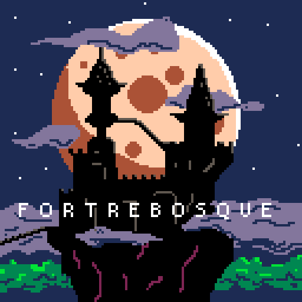
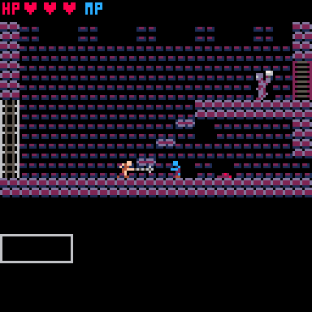
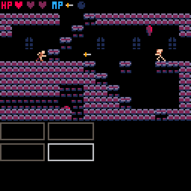
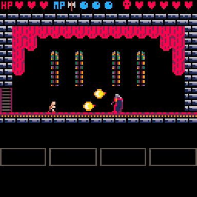

# Fortrebosque

## About
Fortrebosque is a Castlevania fan game made in Pico8.

You can play it [here](https://www.lexaloffle.com/bbs/?tid=157068)!

The game is small, but open-ended. There's 3 bosses and 3 sub-weapons to find in an interconnected castle.

*Simon and his whip/chain/flail thing!*

*Use sub-weapons to help with tricky enemy formations!*

*It's that pallid fella what sucks on blood!*
